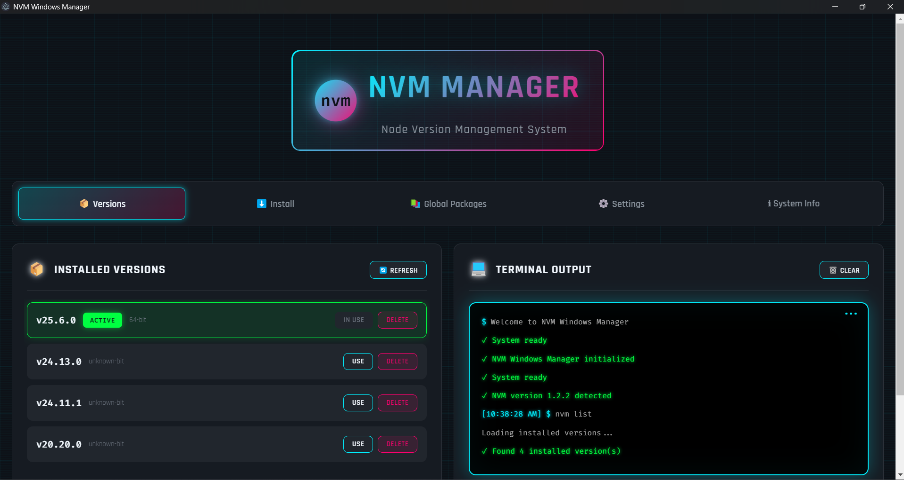
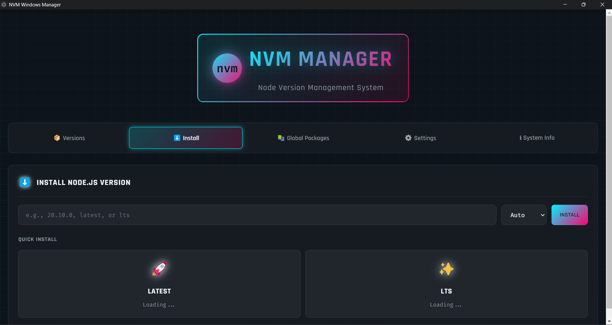
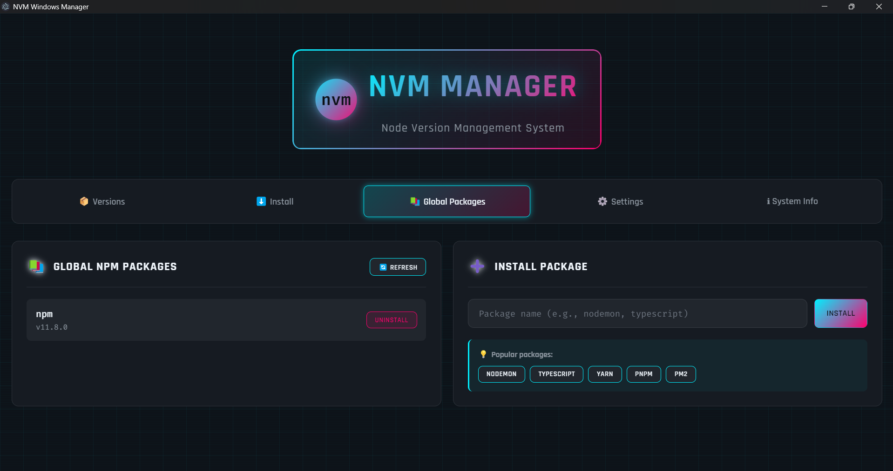
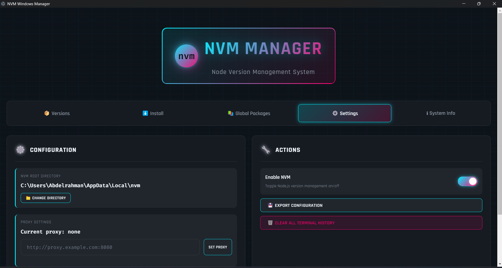
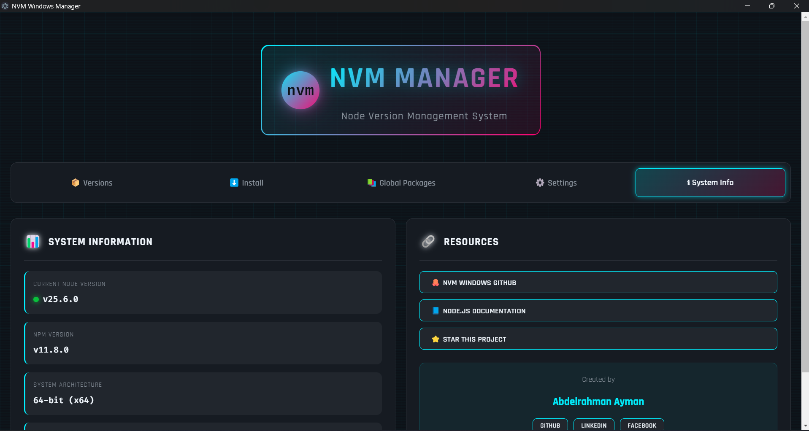

# NVM Windows Manager

<div align="center">


**A modern, feature-rich GUI for managing Node.js versions on Windows**

[](https://opensource.org/licenses/MIT)
[](https://github.com/Abdelrahman968/nvm-win-ui/releases)
[](https://github.com/Abdelrahman968/nvm-win-ui/stargazers)

[Features](#-features) • [Installation](#-installation) • [Usage](#-usage) • [Screenshots](#-screenshots) • [Contributing](#-contributing)

</div>

---

## 🎯 Overview

NVM Windows Manager is a beautiful, cyberpunk-themed desktop application built with Electron that provides a modern graphical interface for [NVM for Windows](https://github.com/coreybutler/nvm-windows). Say goodbye to command-line interfaces and manage your Node.js versions with style!

## ✨ Features

### 🎨 Beautiful Modern UI

- **Cyberpunk-inspired design** with neon accents and smooth animations
- **Dark theme** optimized for developer comfort
- **Responsive layout** that adapts to your screen

### 📦 Version Management

- ✅ View all installed Node.js versions at a glance
- ✅ Install any version (latest, LTS, or specific version)
- ✅ Switch between versions with one click
- ✅ Uninstall unused versions
- ✅ Architecture selection (32-bit, 64-bit, or both)
- ✅ Version badges (Active, LTS, Current)

### 📚 Global Package Management

- 📋 List all globally installed npm packages
- ➕ Install global packages with ease
- 🗑️ Uninstall packages you don't need
- 💡 Quick-install popular packages (nodemon, typescript, yarn, etc.)

### ⚙️ Advanced Configuration

- 📁 Change NVM root directory
- 🌐 Configure proxy settings
- 🔧 Set default architecture
- 🔄 Enable/disable NVM
- 💾 Export configuration

### 💻 Real-time Terminal

- 📟 Live command output display
- 🎯 Color-coded messages (success, error, warning)
- 📝 Command history
- 🧹 Clear terminal option

### 📊 System Information

- 🔍 Current Node.js version
- 📦 NPM version
- 💿 System architecture
- 🔢 NVM version
- 💾 Disk usage tracking

## 🚀 Installation

### Prerequisites

1. **NVM for Windows** must be installed on your system
   - Download from: https://github.com/coreybutler/nvm-windows/releases
   - Install the latest version

2. **Node.js** (any recent version)
   - If you have NVM installed, any Node version will work

### Method 1: Download Pre-built Release (Recommended)

1. Go to the [Releases](https://github.com/Abdelrahman968/nvm-win-ui/releases) page
2. Download the latest `.exe` installer
3. Run the installer
4. Launch "NVM Windows Manager" from your Start Menu

### Method 2: Build from Source

```bash
# Clone the repository
git clone https://github.com/Abdelrahman968/nvm-win-ui.git
cd nvm-win-ui

# Install dependencies
npm install

# Run the application
npm start

# Or build for production
npm run build
```

## 📖 Usage

### Installing a Node.js Version

1. Navigate to the **Install** tab
2. Enter a version number (e.g., `20.10.0`, `latest`, or `lts`)
3. Select architecture (or leave as Auto)
4. Click **Install**
5. Wait for the installation to complete

**Quick Install Options:**

- Click on **Latest** or **LTS** cards for one-click installation

### Switching Versions

1. Go to the **Versions** tab
2. Find the version you want to use
3. Click the **Use** button next to it
4. The terminal will show confirmation

### Managing Global Packages

1. Switch to the **Packages** tab
2. View all installed global packages
3. To install a new package:
   - Enter the package name
   - Click **Install**
4. To remove a package:
   - Click **Uninstall** next to the package

### Configuring Settings

1. Open the **Settings** tab
2. Configure:
   - NVM root directory
   - Proxy settings
   - Default architecture
3. Toggle NVM on/off as needed
4. Export your configuration for backup

## 🖼️ Screenshots

<div align="center">

### Main Interface



### Install Tab



### Global Packages



### Settings & Configuration



### System Info



</div>

## 🎨 Tech Stack

- **Electron** - Cross-platform desktop app framework
- **Node.js** - JavaScript runtime
- **HTML/CSS/JavaScript** - Frontend interface
- **IPC** - Inter-process communication
- Custom cyberpunk-inspired design system

## 🔧 Development

### Project Structure

```
nvm-win-ui/
├── main.js           # Electron main process
├── preload.js        # Secure bridge between processes
├── index.html        # UI interface
├── renderer.js       # Frontend logic
├── package.json      # Project configuration
└── README.md         # Documentation
```

### Building

```bash
# Development mode
npm start

# Build for Windows (64-bit)
npm run build:win

# Build for Windows (32-bit)
npm run build:win32

# Create distributable
npm run dist
```

## ⚠️ Important Notes

- **Administrator Rights**: NVM operations require administrator privileges. Run the app as administrator if you encounter permission errors.

- **Terminal Restart**: After switching Node.js versions, you may need to restart your terminal/command prompt for changes to take effect.

- **PATH Configuration**: Ensure NVM is properly added to your system PATH.

## 🐛 Troubleshooting

### Application doesn't show versions

1. Verify NVM for Windows is installed: `nvm version` in CMD
2. Check if NVM is in your PATH
3. Run the application as Administrator

### Commands not executing

1. Restart the application as Administrator
2. Check NVM installation
3. Verify PATH settings

### Installation fails

1. Check internet connection
2. Verify proxy settings (if behind a firewall)
3. Try installing via command line first to identify issues

## 🤝 Contributing

Contributions are welcome! Please feel free to submit a Pull Request.

1. Fork the repository
2. Create your feature branch (`git checkout -b feature/AmazingFeature`)
3. Commit your changes (`git commit -m 'Add some AmazingFeature'`)
4. Push to the branch (`git push origin feature/AmazingFeature`)
5. Open a Pull Request

## 📝 Changelog

See [CHANGELOG.md](CHANGELOG.md) for a list of changes and version history.

## 📄 License

This project is licensed under the MIT License - see the [LICENSE](LICENSE) file for details.

## 👨‍💻 Author

**Abdelrahman**

- GitHub: [@Abdelrahman968](https://github.com/Abdelrahman968)
- LinkedIn: [Abdelrahman](https://www.linkedin.com/in/abdelrahman968)
- Facebook: [Abdelrahman](https://www.facebook.com/Abdelrahman.968)

## 🙏 Acknowledgments

- [NVM for Windows](https://github.com/coreybutler/nvm-windows) by Corey Butler - The underlying tool that makes this possible
- [Electron](https://www.electronjs.org/) - Framework for building desktop apps
- [Node.js](https://nodejs.org/) - JavaScript runtime

## ⭐ Show Your Support

If you find this project useful, please consider giving it a star on GitHub! It helps others discover the project.

[](https://github.com/Abdelrahman968/nvm-win-ui/stargazers)

---

<div align="center">

Made with ❤️ by [Abdelrahman](https://github.com/Abdelrahman968)

**NVM Windows Manager** - Making Node.js version management beautiful

</div>
